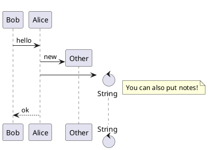

+++
title = 'Test'
date = 2024-04-08T23:57:04+08:00
+++

# 这是一个测试页面


 ## 测试PlantUML





## 测试KaTex


 Inline math:
$$ \varphi = \dfrac{1+\sqrt5}{2}= 1.6180339887… $$

 or
 Block math:
$$
\varphi = 1+\frac{1} {1+\frac{1} {1+\frac{1} {1+\cdots} } }
$$


## 哔哩哔哩视频测试




## 代码测试


```cpp
#define listder hentai
```


## 剧透测试


透你！


